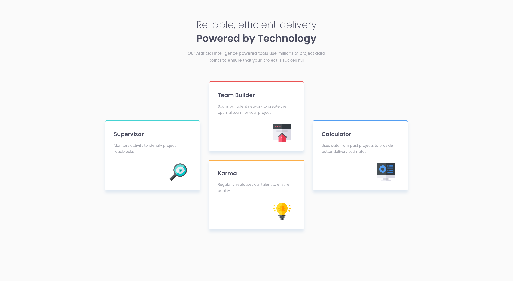

## Overview

### The challenge

Users should be able to:

- View the optimal layout for the site depending on their device's screen size

### Screenshot

### Built with

- Semantic HTML5 markup
- CSS custom properties
- CSS Grid

### What I learned

- Local CSS custom properties
- CSS Grid
- margin-inline and margin-block
